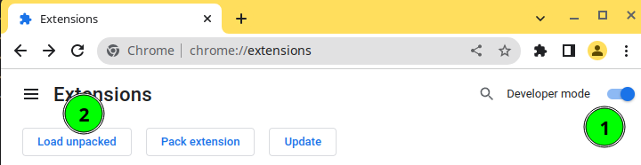

<div align="center">


</div>

# Vitaly - starter template for Chrome Extension MV3 - Vite, Vue3, Typescript

Vitaly is a starter for the Chrome extension (Manifest V3) with Vue3 + Typescript, build and bundled using Vite!

## Features

- 🥳 [Manifest V3](https://developer.chrome.com/docs/extensions/mv3/intro/)
- ⚡️ [Vite 3](https://github.com/vitejs/vite) and [Vue 3](https://github.com/vuejs/core)
- 🦾 TypeScript
- 🤙🏻 [Prettier](https://prettier.io/) and [ESlint](https://eslint.org/) with sensible settings
- ✨ Including [webextension-polyfill](https://github.com/mozilla/webextension-polyfill) to work on multi-browser extension (if needed)
- ⭐ Using [CRXJS](https://github.com/crxjs/chrome-extension-tools) to build extension
- 🔥 Hot Module Reload (HMR) (thanks to [CRXJS](https://github.com/crxjs/chrome-extension-tools))
- ✍️ Example of content script, popup and options page
- ⚙️ Run, build and package extension (for Chrome-based browsers) - with single commands :-) 

## Scaffold your new extension with Vitaly

> Vitaly requires Node > 16.16.0 but should work with 14.x too! Tweak `engines` section in `package.json` if needed. :-)

### GitHub Template

[Create a repo from this template on GitHub](https://github.com/elwin013/vitaly-extension/generate).

### Scaffold locally

You can also use [degit](https://github.com/Rich-Harris/degit) to easy scaffold new extension locally

```bash
npx degit elwin013/vitaly-extension my-new-great-extension
cd my-new-great-extension
npm install
```

## Developing your extension with Vitaly

> For details about extension version - please see `Extension version in manifest.json`!

Developing extension is easy and pretty straightforward. 
Thanks to working HMR you will not have to remove and add extension manually.

1. Install dependencies with `npm install`.
2. Run `npm run start` to build development version and development server.
3. Load `dist` directory into Chrome as an unpacked extension (see screnshot below).
    1. Open `chrome://extensions`
    2. Turn on `Developer mode`
    3. Select `Load unpacked` and open `dist` folder

    

4. That's all, folks! You have working extension and can develop it!


## Packaging production version of extension

> For details about extension version - please see `Extension version in manifest.json`!

1. Install dependencies with `npm install`.
2. Generate private and public key pair for extension - `cd secrets/ && sh generate-secrets.sh && cd ../`.
3. Run `npm run package` to build production version of extension and package it into `.crx` file.
4. Packaged extension will be in `dist/name-from-package-json.crx`.

Scripts for generating secrets is based on [this answer on StackOverflow by wOxxOm](https://stackoverflow.com/a/23877974). 
To obtain extension id from private key you can use command `2>/dev/null openssl rsa -in secrets/private-key.pem -pubout -outform DER |  shasum -a 256 | head -c32 | tr 0-9a-f a-p`.

## Extension version in manifest.json

All metadata of extension is stored in `src/manifest.json`. 
During build process version in aforementioned file is replaced with the version from `package.json.`
This allows to easily bump version of extension using e.g. `npm version x.y.z`.

## License

[MIT](LICENSE)
